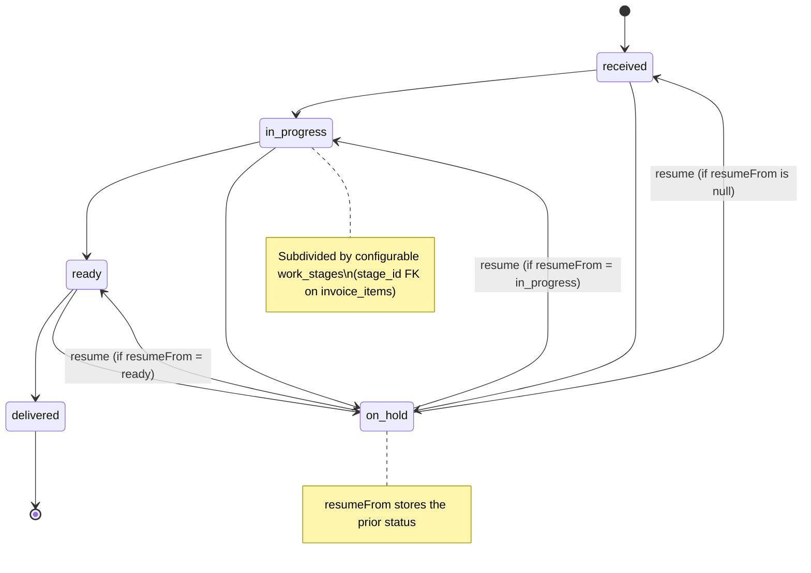

# Work Status & Production State Machine

**Source:** [`src/domain/production.ts`](../../src/domain/production.ts)  
**Aggregation helpers:** [`src/domain/aggregation.ts`](../../src/domain/aggregation.ts)

---

## The `WorkStatus` enum

`WorkStatus` mirrors the Postgres `work_status` DB enum on `invoice_items.work_status`.

```
'received' | 'in_progress' | 'ready' | 'delivered' | 'on_hold'
```

The DB enum was previously called `qc`; that value has been removed.

---

## Linear flow

`LINEAR_FLOW` defines the **forward-only** happy path:

```
received → in_progress → ready → delivered
```

`nextWorkStatus(current)` returns the next status in this array, or `null` if `current` is `delivered` (terminal) or not in the flow.

`on_hold` is **off-flow** — it is not part of `LINEAR_FLOW` and `nextWorkStatus` never returns it.

---

## State diagram



---

## `on_hold` round-trip

```ts
hold(current)  // → { status: 'on_hold', resumeFrom: current }
resume(resumeFrom)  // → resumeFrom ?? 'received'
```

**Wired as of Plan 4** (server-first). The `resume_status` column (Plan 2) exists in the live DB. `updateWorkStatusAction` (`src/data/invoice-actions.ts`) manages it automatically:
- entering `on_hold` from a non-hold status → stores the prior `work_status` in `resume_status` (`hold().resumeFrom`);
- re-selecting `on_hold` while already on hold → **preserves** the remembered status (a misclick won't wipe it);
- any non-hold target → clears `resume_status` to null.

The work queue and the invoice-detail editor surface a **"Resume (&lt;prior&gt;)"** option on held items, targeting `resume(resume_status)` (falls back to `received`).

**Known limitation:** `resume_status` is a bare `work_status` enum, so an item held while `in_progress` **on a specific stage** resumes to bare `in_progress` (stage_id cleared) — the stage is not remembered. Storing the encoded value (or a `resume_stage_id` column) would be needed to preserve it; deferred.

---

## Stage subdivision — `encodeWork` / `decodeWork`

The `in_progress` phase is further subdivided by **configurable `work_stages`** (admin-managed taxonomy: `label`, `color`, `sort_order`, `is_active`).

`invoice_items` has a nullable `stage_id` FK pointing to `work_stages`. The combination `(work_status, stage_id)` is the full production position.

To represent this pair as a single dropdown value, use:

| Situation | Encoded value |
|---|---|
| `in_progress` + `stage_id = "abc"` | `"stage:abc"` |
| `in_progress` + `stage_id = null` | `"in_progress"` |
| Any other `work_status` | The bare status string |

```ts
encodeWork(work_status, stage_id)  // → encoded string
decodeWork(value)                  // → { work_status, stage_id }
```

Items on **retired/inactive stages** remain visible in the work queue; `workOptionsForItem` guarantees their encoded value is present in the dropdown even if the stage is no longer active.

---

## Canonical option order

`workOptions(activeStages)` produces:

```
Received → [active stage 1] → [active stage 2] → … → Ready → Delivered → On Hold
```

`orderedGroupKeys` uses the same canonical order for the work-queue Kanban columns, appending any present non-canonical keys (inactive stages, bare `in_progress`) just before `Ready`.

---

## Aggregation (`src/domain/aggregation.ts`)

`dominantProductionStatus(items)` returns the single "headline" status for a set of work items, using attention-first priority:

```
on_hold > received > in_progress > ready > delivered
```

An empty item set returns `'received'`.

`summarizeProduction(items)` returns a count map `{ on_hold: N, received: N, ... }` in the same priority order.

---

## How to change this

### Add a new work status (e.g. `qc`)
1. Add the literal to `WorkStatus` in `src/domain/production.ts`.
2. Add a migration to add the value to the `work_status` Postgres enum (`ALTER TYPE work_status ADD VALUE 'qc'`).
3. Decide whether it belongs in `LINEAR_FLOW` (forward-only) or is off-flow like `on_hold`.
4. If in-flow: insert it into `LINEAR_FLOW` at the right position; `nextWorkStatus` automatically picks it up.
5. If off-flow: add hold/resume helpers analogous to `hold`/`resume`.
6. Update `DOMINANT_PRIORITY` in `src/domain/aggregation.ts` if the new status should affect invoice-level headline status.
7. Add display entries: `WORK_STATUS_LABELS`, `WORK_STATUS_COLORS`, `WORK_STATUS_FILLED`, `WORK_STATUS_OUTLINED`.

### Change the stage subdivision logic
Edit `encodeWork`/`decodeWork` in `src/domain/production.ts`. Both directions must stay inverse to each other. The encoded string format (`stage:<id>`) is used as a React key and a URL-parameter value — changing the format is a breaking change.

### Remember the stage across an on_hold round-trip
Currently `resume_status` (a bare `work_status`) loses the `in_progress` stage. To preserve it, either store the **encoded** value (`stage:<id>`) in a `text` column or add a `resume_stage_id` FK, then have `updateWorkStatusAction` capture/restore it alongside `resume_status`.
